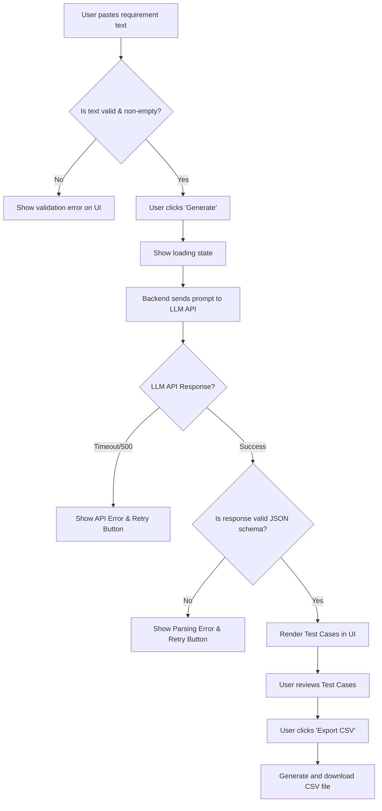

# AI Manual Test Case Generator
**ID**: TC-GEN-001
**Version**: 1.0
**Status**: Draft
**Type**: New Feature

## Overview & Purpose
The AI Manual Test Case Generator is a web-based utility designed to automatically translate software requirements, user stories, or acceptance criteria into structured, ready-to-execute manual test cases. Writing manual test cases is traditionally a time-consuming and repetitive process prone to human error and inconsistent formatting. This feature leverages a Large Language Model (LLM) to parse plain text requirements and output comprehensive test scenarios (including positive, negative, and edge cases) formatted with clear titles, preconditions, steps, and expected results.

## Goals
*   Reduce the average time spent writing manual test cases by 70%.
*   Standardize the format and quality of manual test cases across the QA team.
*   Increase test coverage by automatically identifying negative and edge-case scenarios that a human might overlook.

## Target Users
*   **QA Engineers**: Primary users who will input requirements to generate baseline test cases for their testing cycles.
*   **Business Analysts / Product Managers**: Secondary users who will use the tool to validate that their acceptance criteria are testable and comprehensive.

## Stakeholders
*   **QA Lead**: Responsible for test quality and standardization.
*   **Engineering Manager**: Interested in team velocity and reducing testing bottlenecks.
*   **Product Owner**: Ensures generated tests accurately reflect business requirements.

## Scope (In / Out)
**In scope**:
*   Plain text input interface for pasting user stories, acceptance criteria, or feature descriptions.
*   Integration with an LLM API to process text and generate test cases.
*   UI to display generated test cases (Title, Preconditions, Steps, Expected Results, Type).
*   Export functionality to download generated test cases as a CSV file.
*   Basic error handling for API timeouts and invalid inputs.

**Out of scope**:
*   Direct integration with issue trackers (e.g., Jira, Azure DevOps) or test management tools (e.g., TestRail, Xray) via API.
*   Generation of automated test scripts (e.g., Selenium, Cypress, Playwright code).
*   Support for file uploads (e.g., PDF, DOCX) as input.
*   Saving or persisting generated test cases in a local database (stateless application).

## MoSCoW
*   **Must Have**: Text input area, LLM-based test case generation, structured UI display of results, copy-to-clipboard functionality.
*   **Should Have**: CSV export functionality, categorization of tests (Happy Path, Negative, Edge Case).
*   **Could Have**: Markdown export functionality, ability to edit test cases directly in the UI before export.
*   **Won't Have**: Automated code generation, direct Jira/TestRail API syncing, user accounts/authentication (for MVP).

## Functional Requirements
**FR1: Requirement Text Input**
The system must provide a text area allowing users to input up to 10,000 characters of requirement text.
*   **Acceptance Criteria**:
    *   **Given** the user is on the generator interface, **When** they enter text exceeding 10,000 characters, **Then** the system truncates the input or prevents further typing and displays a character limit warning.
    *   **Given** the user is on the generator interface, **When** they attempt to submit an empty text area, **Then** the system disables the submit button and prompts the user to enter requirements.

**FR2: Test Case Generation**
The system must process the input text and generate a structured array of test cases, ensuring coverage of positive, negative, and edge cases.
*   **Acceptance Criteria**:
    *   **Given** valid requirement text is submitted, **When** the system successfully processes the request, **Then** it outputs at least one "Happy Path" test case and at least one "Negative" or "Edge Case" test case.
    *   **Given** the system generates test cases, **When** they are displayed, **Then** each test case must contain a Title, Preconditions, numbered Steps, and Expected Results.

**FR3: CSV Export**
The system must allow users to download the generated test cases in a CSV format compatible with standard spreadsheet software.
*   **Acceptance Criteria**:
    *   **Given** test cases have been generated and displayed, **When** the user clicks "Export to CSV", **Then** the browser downloads a file named `test_cases_[timestamp].csv` containing columns for Type, Title, Preconditions, Steps, and Expected Results.

## User Stories
**US1: Generate Tests from User Story**
*   **As a** QA Engineer
*   **I want** to paste a user story with acceptance criteria into the tool
*   **So that** I can instantly receive a comprehensive suite of manual test cases without writing them from scratch.
*   **Acceptance Criteria**:
    *   **Given** I have pasted a user story, **When** I click "Generate Test Cases", **Then** I see a loading indicator while the system processes the request.
    *   **Given** the system has finished processing, **When** the results load, **Then** I see a formatted list of test cases categorized by type.

**US2: Export Tests for Test Management Tool**
*   **As a** QA Engineer
*   **I want** to export the generated test cases to a CSV file
*   **So that** I can bulk-import them into my company's Test Management software (e.g., TestRail).
*   **Acceptance Criteria**:
    *   **Given** I am viewing generated test cases, **When** I click the CSV export button, **Then** a properly delimited CSV file is downloaded to my local machine.
    *   **Given** the CSV is generated, **When** I open it, **Then** multi-line steps and expected results are properly enclosed in quotes to prevent breaking the CSV structure.

## Inputs/Outputs/Data Flow
**Inputs**:
*   `requirement_text` (String): The raw text pasted by the user (max 10,000 chars).
*   `generation_parameters` (Object): Hidden system prompts defining the JSON schema the LLM must return.

**Outputs**:
*   `test_cases` (Array of Objects): The structured response from the LLM.
    *   `type` (String: "Positive", "Negative", "Edge Case")
    *   `title` (String)
    *   `preconditions` (String)
    *   `steps` (String - newline separated)
    *   `expected_results` (String)
*   `export_file` (CSV): The downloadable file representation of the `test_cases` array.

**Data Flow**:
1. User submits `requirement_text` via the frontend UI.
2. Frontend sends a POST request to the backend API with the text.
3. Backend constructs a prompt combining the `requirement_text` and system instructions, sending it to the external LLM API.
4. LLM API returns a JSON string representing the `test_cases` array.
5. Backend validates the JSON schema and returns it to the frontend.
6. Frontend renders the JSON into HTML cards/tables.
7. User triggers CSV generation entirely client-side based on the rendered JSON state.

## Flows & Diagrams

**Main (Happy) Flow & Alternate Flows**

## Edge Cases & Error States
*   **Edge Case: Gibberish or Non-Software Input**: User pastes a recipe or random characters.
    *   *Error Handling*: The LLM prompt must instruct the model to return a specific error JSON flag if the text is not a software requirement. The UI will display: "The provided text does not appear to be a software requirement. Please check your input."
*   **Edge Case: Extremely short input**: User types "login page".
    *   *Error Handling*: The system will generate generic login test cases, but the UI should display a warning: "Input is very short. Generated test cases may be generic. Provide more detail for better results."
*   **Failure Mode: LLM API Timeout or Outage**: The external AI provider is down.
    *   *Error Handling*: The backend must timeout after 30 seconds and return a 503 error. The UI will display: "The AI generation service is currently unavailable or timed out. Please try again in a few moments."
*   **Failure Mode: Malformed JSON from LLM**: The LLM hallucinates and breaks the requested JSON schema.
    *   *Error Handling*: The backend validation fails. The system should automatically retry the LLM request once. If it fails again, display to the user: "An error occurred while formatting the test cases. Please try generating again."

## Acceptance Criteria
*(Consolidated system-level criteria)*
*   **Given** a user inputs valid requirement text, **When** they request generation, **Then** the system must return a structured list of test cases within 30 seconds.
*   **Given** the LLM API is unreachable, **When** the user requests generation, **Then** the system must gracefully fail and display a user-friendly error message without crashing.
*   **Given** the user has generated test cases, **When** they export to CSV, **Then** the resulting file must correctly escape commas and newlines within the test steps and expected results.
*   **Given** the user inputs text exceeding the maximum length, **When** they attempt to paste or type, **Then** the input is truncated at 10,000 characters.

## Non-Functional Requirements
*   **Performance**: The end-to-end generation process must complete within 30 seconds for a 5,000-character input. UI interactions (like CSV export) must be instantaneous (< 500ms).
*   **Security & Privacy**: The system must not log or store the user's requirement text in any persistent database to prevent leakage of proprietary company information. Text is only held in memory during processing.
*   **Availability**: The web interface should target 99.9% uptime, independent of the external LLM API's uptime.
*   **Usability**: The interface must be fully responsive and usable on standard desktop monitors (1080p) and laptop screens (720p). Mobile support is not required.

## Assumptions
*   An external LLM API (e.g., OpenAI GPT-4o or Anthropic Claude 3.5 Sonnet) is available, funded, and approved for use by the organization.
*   Users are testing standard web, mobile, or desktop software where standard manual testing paradigms (Steps, Expected Results) apply.
*   The application will be deployed as a stateless web application (e.g., React frontend, Node.js/Python backend).

## Dependencies
*   **External LLM Provider**: The core generation logic depends entirely on a third-party API.
*   **Frontend CSV Library**: Dependency on a client-side library (e.g., PapaParse or standard Blob API) to handle CSV formatting and escaping.

## Open Questions
*   What specific CSV column headers and formatting rules are required to ensure seamless import into the organization's specific Test Management Tool (e.g., TestRail vs. Xray)?
*   Should we implement a mechanism to strip potentially sensitive PII (Personally Identifiable Information) from the requirement text before sending it to the external LLM API?

## Success Metrics
*   **Adoption**: 500+ test cases generated by the QA team within the first 30 days of launch.
*   **Efficiency**: 50% reduction in the time logged for "Test Case Creation" tasks in Jira during the first full sprint post-launch.
*   **User Satisfaction**: An average rating of 4 out of 5 or higher on internal user feedback surveys regarding the quality and accuracy of the generated tests.